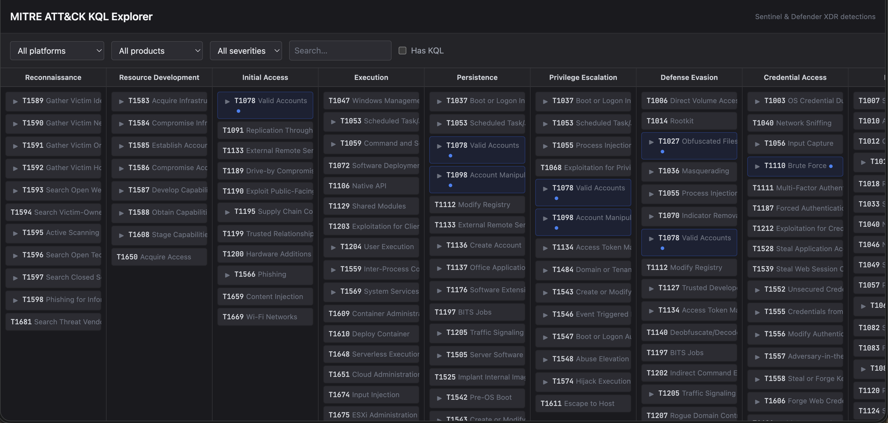

# MITRE ATT&CK KQL Explorer

Interactive MITRE ATT&CK matrix mapped to production-ready KQL queries for Microsoft Sentinel and Defender XDR.



## Use it

Open the live app: [mitre-selector.vercel.app](https://mitre-selector.vercel.app)

No setup required. Browse the matrix, click a technique, copy the KQL.

## Contribute

1. Fork the repo
2. Add KQL queries to `data/kql_mappings.json` following the schema in [CONTRIBUTING.md](CONTRIBUTING.md)
3. Submit a PR

See [CONTRIBUTING.md](CONTRIBUTING.md) for the full KQL quality requirements and mapping ID conventions.

## Self-host

```bash
git clone https://github.com/triathIC/Mitre-selector.git
cd Mitre-selector
npm install
npm run dev
```

Deploys to Vercel out of the box — just import the repo.

## STIX data update

```bash
npm run generate-mitre-data
```

Generates `data/mitre_techniques.json` from the official [MITRE ATT&CK STIX bundle](https://github.com/mitre/cti). The CI workflow runs this weekly and opens a PR if techniques changed.

## Tech stack

React, TypeScript, Vite, TailwindCSS.

## License

[MIT](LICENSE)
